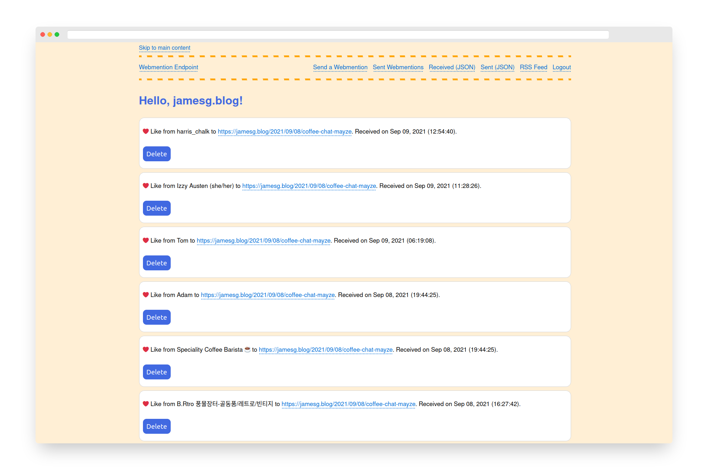

# Python Webmention Receiver

This project contains the source code for a webmention receiver. There is also an endpoint for sending webmentions in this codebase.

If you have not heard of webmentions, I would encourage you to check out the [IndieWeb wiki webmentions page](https://indieweb.org/Webmention) to learn more. In short, webmentions are a way for you to send a message from one website to another. This approach lets you maintain control over your own content while also allowing you to share your content with others.

To use this project, you will need to replace all mentions of "jamesg.blog" with your own domain name in the codebase.

## Screenshot

## Endpoints

Here are the endpoints supported by this project:

- / - Endpoint for receiving webmentions.
- /home - See the webmentions you have received.
- /sent - See webmentions you have sent.
- /send - Endpoint to send a webmention.
- /send/open - Open endpoint for anyone to submit a webmention to my site. Used on my "Submit a webmention" forms on my blog posts.
- /retrieve - See webmentions you have received in JSON.

## webmention.rocks Validation

[webmention.rocks](https://webmention.rocks/) is being used to test compliance with the webmention specification for receiving and sending webmentions.

## Sender Discovery Compliance

So far, this repository has passed tests in the "sender discovery" category.

- https://webmention.rocks/test/1
- https://webmention.rocks/test/2
- https://webmention.rocks/test/3
- https://webmention.rocks/test/4
- https://webmention.rocks/test/5
- https://webmention.rocks/test/6
- https://webmention.rocks/test/7
- https://webmention.rocks/test/8
- https://webmention.rocks/test/9
- https://webmention.rocks/test/10
- https://webmention.rocks/test/11
- https://webmention.rocks/test/12
- https://webmention.rocks/test/13
- https://webmention.rocks/test/14
- https://webmention.rocks/test/15
- https://webmention.rocks/test/16
- https://webmention.rocks/test/17
- https://webmention.rocks/test/18
- https://webmention.rocks/test/19
- https://webmention.rocks/test/20
- 21 IN PROGRESS
- https://webmention.rocks/test/22
- https://webmention.rocks/test/23

Please refer to the [webmention.rocks](https://webmention.rocks/) website for specifics on each of these tests and what they mean.

## Reciever Tests

This application has passed the following receiver tests:

- https://webmention.rocks/receive/1
- https://webmention.rocks/receive/2

## How to set up

To set up this project, first configure a Python virtual environment:

    virtualenv venv
    source venv/bin/activate

Then you should install the dependencies necessary to run this project:

    pip install -r requirements.txt

### Configuration variables

You will then need to create a .env file. This file should contain an API key that you keep to yourself:

    api-key=THIS_IS_YOUR_KEY

Please also read the config.py file and populate it with the correct values.

You will need to specify the callback URL for your webmention endpoint, your client ID, your token endpoint, your domain name, and the directory in which your RSS feed should be placed.

Examples are provided in the config.py file.

### Setting up the database

To set up the database for this project, execute the following command:

    flask seed create-tables

The command above creates the database tables for this project.

Now you are ready to use the endpoint. To run the server, run this command:

    flask run

In accordance with the webmention specification, the webmention receiver processes webmentions asynchronously. I use cron to process webmentions every hour.

To process webmentions, you should set up a cron job that executes the validate_webmention.py script. An example cron job you could use is:

    0 * * * * python3 /path/to/webmention_receiver/validate_webmention.py

api-key should be equal to the value of api-key that you set in your .env file.

## Configuring Automatic Webmention Sending

You can request that mentions are sent to all links in a h-feed as soon as you publish a resource on your website.

This is useful if you want people who use webmentions to get notified when you link to their content without having to manually send webmentions to each link.

You can do this by triggering the following webhook after your site has been deployed:

    https://yourwebmentionendpoint.com/webhook?url=https://yourdomain.com/

This webhook can be triggered for any URL on your site that contains a h-feed.

## License

This project is licenced under the MIT License.

## Contributing

If you have ideas on how to make this webmention endpoint better, feel free to create an Issue for discussion on the GitHub Issues page.

## Contributors

- capjamesg